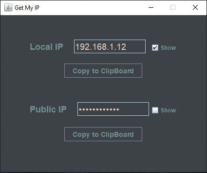

# Get My Ip
Get your Local and Public IPv4 Adresses with JAVA !

### UI🔧

###  How to Import to Netbeans🔌
1. **Fork** it! 
2. Dowload the ZIP and import it(File->Import Project->From ZIP)! **OR** Clone it(Team->Git->Clone..)!
